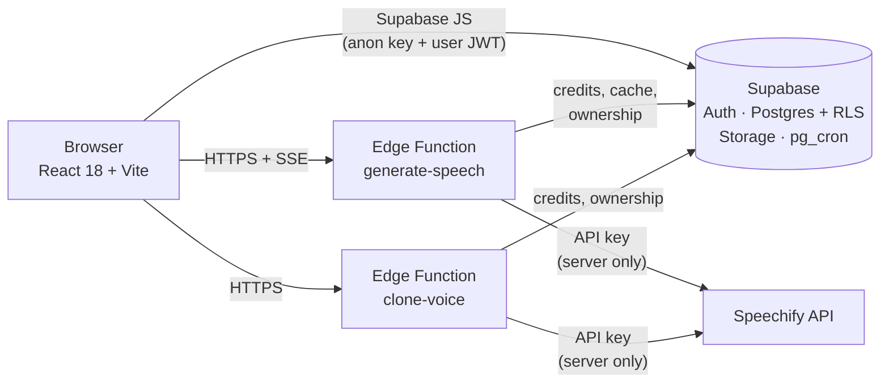

<div align="center">


# VoiceForge

**A text-to-speech studio for long-form voiceovers.**
Write in paragraphs, pick a voice, shape the delivery, and export audio with matching subtitles.

[](https://github.com/BDani99/Voiceforge/actions/workflows/ci.yml)


[Features](#features) ·
[Getting started](#getting-started) ·
[Supabase setup](#supabase-setup) ·
[Architecture](#architecture) ·
[Design system](DESIGN.md)

</div>

---

## What it is

VoiceForge turns text into speech with the [Speechify API](https://docs.speechify.ai/). A project is a
list of paragraphs; each paragraph has its own audio, timeline and settings. Everything that costs
money (API key, credits) lives behind Supabase Edge Functions, so the browser never sees a secret.

- Pick from every Speechify voice, or **clone your own** from a short sample.
- Control **emotion, emphasis, pronunciation and pauses** on any part of the text.
- **Hear a paragraph while it is still being generated**, with the spoken word highlighted.
- Export **audio plus `.srt` / `.vtt` subtitles** that line up with it.
- Credits, rate limiting, suspension and an **admin area** are built in.

## Features

### Workspace

| | |
| --- | --- |
| **Voice picker** | The selected voice is a card (avatar, gender, language, model). It opens a searchable list of all voices, filterable by language, model, use case and gender, with a sample player for each. |
| **Models** | Chosen automatically for the voice and language (Simba 3.2 for English, Simba 3.0 for the other supported languages) and changeable by hand. Legacy models are marked. |
| **Emotion** | For a whole paragraph, for all paragraphs at once, or for highlighted parts of the text. Sent as `<speechify:style>` SSML, only offered for models that support it. |
| **Emphasis, pronunciation, pauses** | Select text and choose *Emphasis* (reduced, moderate, strong), *Pronounce* (read `3/4` as "three quarters") or *Pause*. All of them combine with emotions. |
| **Word timings** | Speech marks are stored with every generated audio. While a paragraph plays, the spoken word is highlighted (karaoke style). |
| **Play while generating** | A new paragraph starts playing as soon as the first audio arrives (server-sent events, raw PCM through Web Audio). The finished file is stored as usual. Can be switched off. |
| **Pitch, speed, volume** | Sit under the voice card and apply to the whole project. |
| **Presets** | Save the whole setup (voice, model, tuning, pauses, emotion). Rename, duplicate, overwrite, and set a default that new projects start with. |
| **Dictionary** | Global text replacements applied before synthesis. |
| **Export** | Audio for a paragraph or the whole project, and `.srt` / `.vtt` subtitles including the pause between paragraphs. |
| **Bottom bar** | Play all, and a segmented progress bar: click a segment to jump, see which paragraphs are generated or generating. |

### Voice cloning

Under **Profile → Voices** a user can clone a voice with Speechify Instant Voice Cloning: a 10–30 second
sample, then the speaker reads a consent phrase issued by Speechify. It is verified against the
sample, so the person being cloned has to record it themselves. A clone costs credits (default
5000, set by an admin) that are refunded when creation fails. Cloned voices carry a **Cloned** badge and
are usable only by their owner (see [Security](#security)).

### Accounts and admin

- E-mail sign-up and login, password strength meter with a breached-password check
  ([Have I Been Pwned](https://haveibeenpwned.com/API/v3#PwnedPasswords) range API, no password leaves the browser).
- Dashboard with projects, search, soft delete and restore.
- Profile with usage statistics, a 14-day usage chart and a credit log.
- **Admin area** (lazy-loaded): dashboard numbers and charts, user management (credits, suspension),
  logs, system settings and a system-wide announcement banner.

### Design

Dark, flat and quiet: one accent colour, a graphite scale and four status colours, no gradients or
glows, and very little motion. The palette, shapes and motion rules are documented in
[DESIGN.md](DESIGN.md).

## Architecture



- **Frontend:** React 18, React Router 7, Vite 7, strict TypeScript, Recharts, lucide icons, plain global CSS
  driven by design tokens.
- **Backend:** Supabase Auth, Postgres with row level security, Storage, `pg_cron`, and two Deno Edge
  Functions: `generate-speech` (voices, speech, streaming) and `clone-voice`.
- **Credits** are charged in exactly one place, the Edge Function. `reserve_credits` checks the account,
  the rate limit and the balance and charges in one SQL statement, so parallel requests can never overdraw an
  account. A successful generation settles the reservation, a failure refunds it, and a scheduled job
  refunds reservations left behind by a crashed request. Audio that is already in the shared cache is free.

## Getting started

**Requirements:** Node.js 20.19 or newer, a Supabase project, a Speechify API key.

```bash
git clone https://github.com/BDani99/Voiceforge.git
cd Voiceforge
npm install
cp .env.example .env      # fill in your Supabase URL and anon key
npm run dev               # http://localhost:3000
```

The app needs the database and Edge Functions from the next section before login and generation work.

| Script               | Purpose                                        |
| -------------------- | ---------------------------------------------- |
| `npm run dev`        | Dev server                                     |
| `npm run build`      | Type-check, then production build into `dist/` |
| `npm run typecheck`  | `tsc --noEmit`                                 |
| `npm run lint`       | ESLint with type-aware rules (fails on warnings) |
| `npm test`           | Unit and component tests (Vitest)              |
| `npm run test:watch` | Tests in watch mode                            |
| `npm run preview`    | Serve the production build                     |

CI ([ci.yml](.github/workflows/ci.yml)) runs type-check, lint, tests, `npm audit` and the build, and
type-checks the Edge Functions with `deno check`.

## Supabase setup

1. **Apply the migrations** in [supabase/migrations](supabase/migrations) in filename order (SQL editor or
   `supabase db push`). They are required, not optional:

   | Migration | What it does |
   | --- | --- |
   | `harden_admin_and_rls` | Admin rights from `users_profile.role` only; protected profile columns (credits, role, ban flag, e-mail); locked-down `usage_logs`, `audio_cache` and storage |
   | `admin_dashboard_stats` | Admin dashboard numbers aggregated in the database |
   | `restrict_function_grants`, `least_privilege` | API roles only get the rights the app needs |
   | `credit_reservations_and_suspension` | Atomic credit reservations, automatic refund of crashed requests (pg_cron), per-minute rate limit, suspension enforced by RLS |
   | `system_settings_policies` | Admin write policies split by command |
   | `presets_default_and_names` | One default preset per user, unique names, `set_default_preset()` |
   | `audio_cache_speech_marks`, `audio_cache_marks_backfill` | Word timings stored with the audio |
   | `voice_cloning` | The `cloned_voices` ownership table |

2. **Set the secrets and deploy the Edge Functions:**

   ```bash
   supabase secrets set SPEECHIFY_API_KEY=<key>
   # optional: restrict browser origins (default: any)
   supabase secrets set ALLOWED_ORIGINS=https://your-app.example.com
   supabase functions deploy generate-speech
   supabase functions deploy clone-voice
   ```

   [supabase/config.toml](supabase/config.toml) keeps `verify_jwt = false` for both functions: they authenticate
   the caller themselves and must answer CORS preflight requests, which carry no JWT. The API key is sent
   to Speechify (`https://api.speechify.ai/v1`) from the server only.

3. Make sure a **public storage bucket** named `voiceovers` exists.
4. Give your admin account `role = 'admin'` in `users_profile`.
5. After schema changes, regenerate the types:
   `supabase gen types typescript --project-id <ref> --schema public > src/types/database.ts`

> Voice cloning needs a Speechify plan that includes it; otherwise creating a voice answers `402`.

## Security

- The Speechify key exists only as an Edge Function secret. `VITE_*` variables are embedded into the
  browser bundle, so only the Supabase URL and anon key belong there.
- Row level security on every table; profile columns such as credits, role and suspension cannot be
  written by the user.
- Cloned voices of all users live in one Speechify account, so ownership is kept in `cloned_voices`
  (a user reads only their own rows, only the Edge Function writes). The voice list contains only the
  requester's clones and `generate-speech` refuses (403) a voice that belongs to somebody else.
- `npm run build` writes `dist/_headers` (Netlify / Cloudflare Pages format) with a strict
  Content-Security-Policy including `frame-ancestors`, HSTS, `X-Frame-Options` and more. On other hosts copy
  them into the server configuration. The HTML carries the CSP as a `<meta>` fallback.

### Production checklist

- **Auth settings (Dashboard → Authentication):** set the real *Site URL* and the redirect allow-list, turn on
  e-mail confirmation with a real SMTP provider (the built-in mailer is heavily rate limited), and enable
  leaked-password protection if your plan includes it.
- **Secrets:** rotate any token that was ever pasted into a chat, ticket or log.

## Project structure

```
config/                    security headers (used by vite.config.ts)
public/                    favicon (the app icon)
src/
  main.tsx, App.tsx        entry point, routes
  context/                 AuthProvider (session + profile, loaded once)
  pages/
    Auth/                  login / register
    Dashboard/             project list
    Profile/               usage stats, account settings, voice cloning
    Workspace/             the editor; its widgets live in Workspace/components
    Admin/                 admin login, layout, users, logs, settings (one lazy-loaded chunk,
                           CSS scoped under .admin-layout)
  components/              shared UI (BrandMark, Modal, ConfirmModal, CustomSelect, Header, ...)
  hooks/                   useSpeechify, useAudioPlayer, useVoiceSettings, usePresets, useVoiceCloning, ...
  services/                Supabase client, Edge Function client, audio storage
  utils/                   SSML builder, audio processing, WAV encoder, captions, chart theme, ...
  types/                   generated database types and app models
  constants/               voice and language constants
  styles/                  theme tokens (theme.css) and global styles
supabase/
  functions/generate-speech/   Edge Function (Deno): index.ts + pure, tested logic.ts
  functions/clone-voice/       Edge Function for Instant Voice Cloning
  migrations/                  SQL migrations
DESIGN.md                  colour palette, shapes, motion rules
```

## Contributing notes

- Global CSS is shared between the user-facing pages (there are no CSS modules), so use unique class
  names. Admin styles must stay under `.admin-layout`.
- Use the design tokens from [theme.css](src/styles/theme.css) and the rules in [DESIGN.md](DESIGN.md):
  no raw colours, no gradients, no `transition: all`.
- Tests never depend on a developer's `.env`: `vite.config.ts` sets a fixed test environment.
- Before committing: `npm run typecheck && npm run lint && npm test`.
